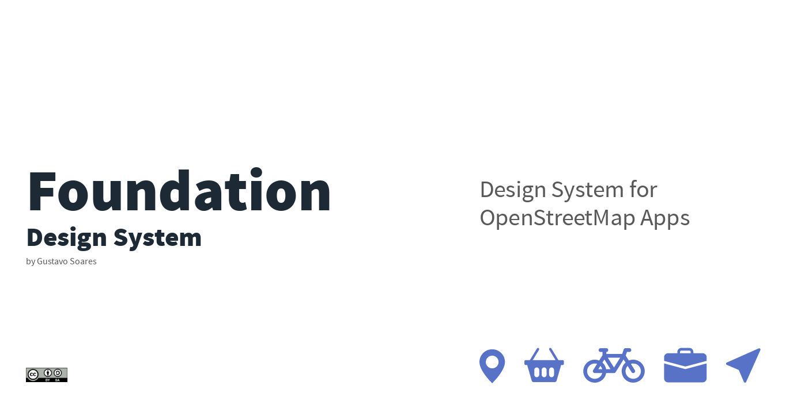

<h1 align="center">
   
  
  Foundation (beta)  

design system for OSM apps

</h1>

## Whats is Foundation? ##

Foundation is a Design System for the OpenStreetMap ecosystem based on [Bootstrap](https://getbootstrap.com/) and keeping the simplicity of OSM.org.

## Typography - [Source Sans Pro](https://fonts.google.com/specimen/Source+Sans+Pro/about) ##

| Class  | Weight | px | px |
| ----- | ----- | --- | --- |
| H1 | 700 | 72px | 4.5rem |
| H2 | 600 | 48px | 3rem |
| H3 | 600 | 40px | 2.5rem |
| H4 | 700 | 24px | 1.5rem |
| H5 | 700 | 20px | 1.25rem |
| H6 | 700 | 18px | 1.125rem |
| Body Light | 300 | 16px | 1rem |
| Body | 400 | 16px | 1rem |
| Body Medium | 600 | 16px | 1rem |
| Small | 400 | 12px | 0.75rem |
| Caption | 700 | 12px | 0.75rem |

## Colors ##

| Color | HEX |
| ----- | ----- |
| Just Blue | #5872C7 |
| Just Green | #6CC559 |
| Dark Blue | #1e2936 |
| Dark Gray | #4c4c4c |
| Gray | #b1b2b5 |
| Red Ice | #e8e9ea |

## Icons ##

- [FontAwesome](https://fontawesome.com/download)
- [Bootstrap Icons](https://icons.getbootstrap.com/)

## Collaborate ##

Look at [CONTRIBUTING](./CONTRIBUTING.md)

## Projects ##
 - [Gaia - Redesign OSM.org](https://github.com/Playzinho/gaia)
## Next steps ##

- Darkmode support
- Port to TailwindCSS

## License ##
- [Creative Commons Attribution 4.0 International Public License](https://creativecommons.org/licenses/by/4.0/)
